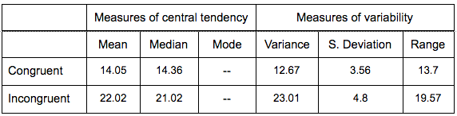
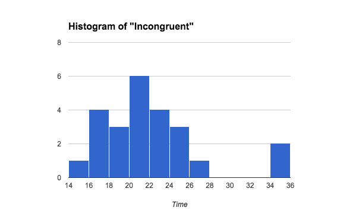

# **Test a Perceptual Phenomenon**

## Introduction

In this project, we will investigate a classic phenomenon from experimental psychology called the [Stroop Effect](https://en.wikipedia.org/wiki/Stroop_effect). We will create a hypothesis regarding the outcome of the task, then look at some data collected from others who have performed the same task and will compute some statistics describing the results. Finally, we will interpret your results in terms of your hypotheses.

**1. What is our independent variable? What is our dependent variable?**

The independent variable is the condition of the task (congruent or incongruent). The dependent variable is the time it takes to name the ink colors of the equally-sized lists. 

**2. What is an appropriate set of hypotheses for this task? What kind of statistical test do you expect to perform? Justify your choices.**

The null hypothesis would be that time to name the ink colors is the same for both conditions. We can intuitively think the incongruent condition would make responses slower, so an appropriate alternative hypothesis would be that the incongruent condition increased the time to name the ink colors. Formally we have:

We want to know this for the population, but we have limited data (sample of n = 24). By testing the sample, we will try to reach a conclusion about the population. 

The test I expect to perform is a dependent t-Test for paired samples (repeated measures design). One-tailed since our alternative hypothesis is "greater than". This is the right choice given the task, where each participant is evaluated on both conditions of the task. Then we focus and do the test on the difference of the results.

**3. Report some descriptive statistics regarding this dataset. Include at least one measure of central tendency and at least one measure of variability.**

**4. Provide one or two visualizations that show the distribution of the sample data. Write one or two sentences noting what you observe about the plot or plots.**

We can see from the shape of the histogram in both visualizations that the samples seem to have a normal distribution. Also, we can see that for the "incongruent" sample there might be a couple of outliers in the data.

**5. Now, perform the statistical test and report your results. What is your confidence level and your critical statistic value? Do you reject the null hypothesis or fail to reject it? Come to a conclusion in terms of the experiment task. Did the results match up with your expectations?**

*Calculations in [this Google Spreadsheet](https://docs.google.com/spreadsheets/d/1gsVWU3SEWAH03T-3R_Eki3tEB-n7u_iINi7YRx2BwFg/edit?usp=sharing).

**6. Optional: What do you think is responsible for the effects observed? Can you think of an alternative or similar task that would result in a similar effect? Some research about the problem will be helpful for thinking about these two questions!**

I think that our brain is used to be in "reading mode" all the time when we see text. This task asks the brain to change this mode, which affects our processing speed. If we are asking our brain now to multitask, it makes sense that processing speed is affected. 

For alternative or similar tasks with same effect, we could try changing the order (first incongruent and then congruent). Also, instead of saying the ink color we could try saying the word. 

Other variation, as mentioned in the wikipedia article, is the emotional Stroop. They use emotional (condition 1) and neutral (condition 2) words which are also colores. What they try to test is if seeing an emotional word also affects the response time. 

## Resources

* Statistics course: Udacity

* For calculations Google Spreadsheets formulas

* Info about the Stroop task: [https://en.wikipedia.org/wiki/Stroop_effect](https://en.wikipedia.org/wiki/Stroop_effect)

