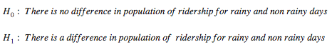

Analyzing the NYC Subway Dataset

# **Statistical Test**

**1.1 Which statistical test did you use to analyze the NYC subway data? Did you use a one-tail or a two-tail P value? What is the null hypothesis? What is your p-critical value?**

I used the Mann-Whitney U-Test. I used a one-tail P value given by the function: scipy.stats.mannwhitneyu with a p-critical of 0.05. The null hypothesis is that the 2 populations are the same:

**1.2 Why is this statistical test applicable to the dataset? In particular, consider the assumptions that the test is making about the distribution of ridership in the two samples.**

This test is applicable to the dataset because it does not assumes the samples are normally distributed. The samples also meet the other assumptions for the Mann-Whitney U-Test because they are independent. When plotting a histogram of the two samples you can see they have similar distribution, but it is a non-normal distribution. So we couldn't use Welch's t-test.

**1.3 What results did you get from this statistical test? These should include the following numerical values: p-values, as well as the means for each of the two samples under test.**

**1.4 What is the significance and interpretation of these results?**

There is a statistical difference between the number of entries for rainy and non-rainy days. Given that the p-value is very small, we can reject the the null hypothesis. Looking at the means, we see rain increases ridership, but of course this is not enough evidence to fully support this affirmation. What we can affirm is that the population of ridership with rain is different than the one without rain. 

# **Linear Regression**

**2.1 What approach did you use to compute the coefficients theta and produce prediction for ENTRIESn_hourly in your regression model:**

I used the OLS using Statsmodels or Scikit Learn.

**2.2 What features (input variables) did you use in your model? Did you use any dummy variables as part of your features?**

* Features: rain, hour and weekday

* Dummy variables: UNIT

**2.3 Why did you select these features in your model? We are looking for specific reasons that lead you to believe that the selected features will contribute to the predictive power of your model.**

My approach was to explore as many different combinations of features as possible and see which one improved my R^2 value. I noticed that as I added more features there would not be a significant improvement in the R^2 value. Finally I sticked to the 3 most significant features that allowed the model to be on target for R^2 value. Same for the dummy features, the only one that would cause significant change. Around 30 points in the R^2 value. 

**2.4 What are the parameters (also known as "coefficients" or "weights") of the non-dummy features in your linear regression model?**

**2.5 What is your model’s R^2 (coefficients of determination) value?**

* The value is: 0.481396426979

**2.6 What does this R^2 value mean for the goodness of fit for your regression model? Do you think this linear model to predict ridership is appropriate for this dataset, given this R^2****  ****value?**

The R^2 value is a statistic we use to evaluate the fit of a model and the relation between the X and Y variables. According to [this](http://www.statsoft.com/Textbook/Multiple-Regression#cresidual), we can interpret this like there is 48.14% of the variability explained. This means that there is 51.86% of residual variability in our model. Ideally we would like that our model explained all the variability.

Given that we are trying to predict human behaviour I would say that is linear model is "appropriate" to predict ridership. For other cases like mechanical processes or for example if we needed a model to make an investment, we would need a better model with a better R^2.

# **Visualization**

**3.1 One visualization should contain two histograms: one of  ENTRIESn_hourly for rainy days and one of ENTRIESn_hourly for non-rainy days.**

From this histogram the main insight we can see is that the data is not normally distributed. This helped determine what kind of statistical test we could perform as mentioned previously. Just by looking at the histogram it would seem that there are more entries when it’s not raining. It would be incorrect to assume this because in the dataset there are far less values for rainy days.

*** Please note that ggplot is stacking the bars, so actually bars for "no rain" are on top of bars for “rain”. I have added separate histograms in the folder “charts”.*

**3.2 One visualization can be more freeform. You should feel free to implement something that we discussed in class (e.g., scatter plots, line plots) or attempt to implement something more advanced if you'd like.**

We can compare these 2 bar charts and see entries by day of the week when its raining and when it’s not. What mainly called my attention is that I was expecting both graphs to follow the same trend. This could also be caused by the difference in the amount of data for rainy vs. non rainy days.

# **Conclusion**

**4.1 From your analysis and interpretation of the data, do more people ride the NYC subway when it is raining or when it is not raining?**  

Looking at the data the conclusion is that more people ride the NYC subway when it is raining. It is something that at first glance would make sense as we could think that when it rains people would choose to take the subway instead of walking on the streets. But we can support this statistically by looking at the results of our test and linear model. 

**4.2 What analyses lead you to this conclusion? You should use results from both your statistical tests and your linear regression to support your analysis.**

In one hand we have the results from the Mann-Whitney U-Test which as we saw in question 1.4 tells us with high confidence that there is significance between the ridership for rainy and non rainy days. Also we have both means of entries telling us that there are more entries when it rains. However this is not enough to make a conclusion. 

Now on the other hand, as we saw in question 2.4 when we look at our linear regression model we can see that the "rain" parameter has a coefficient of 37.011838. From the dataset we know that this parameter can have values only of 0 (no rain) and 1 (rain). This mean when it rains we “add” 37.011838 entries hourly. Therefore concluding that rain increases ridership. 

# **Reflection**

**5.1 Please discuss potential shortcomings of the methods of your analysis, including:**

1. **Dataset**

2. **Analysis, such as the linear regression model or statistical test**

In the dataset, I noticed that when it rains, there is a "1" assigned to the entire day (or to each of the 6 hours of the day for which we have data). It could be possible, but common sense would make you think that it unlikely that it rains during the whole day. So there might be some data which is incorrect, meaning some hours that in the dataset appear as raining when it's really not. 

Another possible shortcoming of the dataset is the hours of the day for which we have data: 0:00, 4:00, 8:00, 12:00, 16:00 and 20:00. These might not be the best setting given the question we are trying to answer. For example you could think that between 16:00 and 20:00 there is plenty of activity in the subway because that it’s a timeframe in which people are leaving work, school, etc. If we could have the data with more detail regarding time I think our model could be more accurate. Having a dataset or 2 datasets that would allow us to compare ridership like this example: For UNIT "X”, rainy Monday at 08:00 vs. non-rainy Monday at 08:00. I think this would give us a much better idea of the influence of rain in the ridership. 

For the analysis the main issue that I would bring, like I mentioned before, is that we are trying to make a model to predict human behaviour which is a harder thing to do. As mentioned [here](http://blog.minitab.com/blog/adventures-in-statistics/regression-analysis-how-do-i-interpret-r-squared-and-assess-the-goodness-of-fit), for these types of analyses an R^2 value of less than 50% is acceptable. 

# **References**

* [http://docs.scipy.org/doc/scipy/reference/generated/scipy.stats.mannwhitneyu.html](http://docs.scipy.org/doc/scipy/reference/generated/scipy.stats.mannwhitneyu.html)

* [https://en.wikipedia.org/wiki/Mann%E2%80%93Whitney_U_test](https://en.wikipedia.org/wiki/Mann%E2%80%93Whitney_U_test)

* [http://pandas.pydata.org/pandas-docs/stable/generated/pandas.get_dummies.html](http://pandas.pydata.org/pandas-docs/stable/generated/pandas.get_dummies.html)

* [http://blog.minitab.com/blog/adventures-in-statistics/regression-analysis-how-do-i-interpret-r-squared-and-assess-the-goodness-of-fit](http://blog.minitab.com/blog/adventures-in-statistics/regression-analysis-how-do-i-interpret-r-squared-and-assess-the-goodness-of-fit)

* [https://discussions.udacity.com/t/project-1-what-is-dummy-and-non-dummy-variables/23302](https://discussions.udacity.com/t/project-1-what-is-dummy-and-non-dummy-variables/23302)

* [http://ggplot.yhathq.com/docs/geom_histogram.html](http://ggplot.yhathq.com/docs/geom_histogram.html)

* [http://stackoverflow.com/questions/22599521/how-do-i-create-a-bar-chart-in-python-ggplot](http://stackoverflow.com/questions/22599521/how-do-i-create-a-bar-chart-in-python-ggplot)

* [http://docs.ggplot2.org/current/scale_continuous.html](http://docs.ggplot2.org/current/scale_continuous.html)

* [http://www.statsoft.com/Textbook/Multiple-Regression#cresidual](http://www.statsoft.com/Textbook/Multiple-Regression#cresidual)

**_*Note_***: All results are based on the turnstile_weather_v2.csv file which I used locally and analysed with the scripts in the folder "code".*

