# Wrangle OpenStreetMap Data

Map Area: Caracas, Venezuela

[OpenStreetMap link](https://www.openstreetmap.org/relation/3324365)

[Mapzen XML OSM dataset download link](https://s3.amazonaws.com/metro-extracts.mapzen.com/caracas_venezuela.osm.bz2)

## Problems encountered in your map

#### **1. ****Tagging**** not following informal standards**

To start the analysis, using the file **mapparser.py** I counted the frequency of each tag in the OSM dataset:

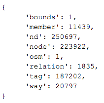

Next, by changing the code in **mapparser.py**, I also wanted to know the most (and least) frequent "key" values. This is for each “tag” element, the value of the “k” attribute. 

Sorting by ascending order, I was able to find out that there were several key values not following the informal standards established on the [wiki](http://wiki.openstreetmap.org/wiki/Map_Features). For example there keys like **"t****witter"**, **“takeaway”** and **“parroquia”** or **“estado”** (which are in spanish and specific to Venezuela’s naming conventions). 

#### **2. Specific keys in tag elements**

Following the analysis using the **mapparser.py** file, I was also able to see that there were many keys used only once or very few times. Examples of such specialized keys used only very few times are: **aerialway:bubble**, **internet_access:operator**. But most of the specific keys were related to "name translations" (for example: **name:vi**, **name:co**, etc. )

These tag keys will be excluded as seen below to define the data model in order to be able to have consistency in the database.

#### **3. Deciding on the data model**

Taking into account the previous 2 points, I will exclude several "keys" from the data model. I will manually select only the ones that make most sense for the analysis will be added. These are aligned with the ones used in lesson 6. Also, following lesson 6, “relation” tags will be excluded, so only “node” and “way” tags will be used to create the data set. 

The data model I decided to use to insert the data into the database is the following:

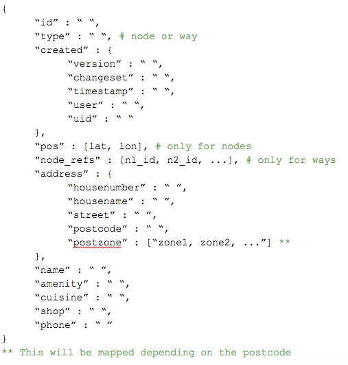

#### **4. Data auditing and cleaning**

With the data model defined, next step was to focus on these "keys" and be able to audit the data. This was done with the **data_audit.py** file. Since there are so many values, I decided to audit a sample of 100 values for each key. This allowed me to detect possible data quality issues such as invalid street names, abbreviations, postal codes and phone formats, etc. 

To visualize the data I generated a file (**keys-data.json**) and used an [online json viewer](http://jsonviewer.stack.hu/) to be able to see it in a clear way. From the audit, I concluded the following issues should be fixed in order to clean the data and improve its quality:

* Phone numbers should be formated like this: +58-212-xxxxxxx

* House numbers should be numerical only

* Post codes should be a 4 digit number

* Street abbreviations should be changed to follow this mapping: {

	"Av." : “Avenida”,

"Av"  : “Avenida”,

"av"  : “Avenida”

}

Additional improvement to the data will be made regarding the inconsistent keys likes **"parroquia"** or **“estado” **mentioned on the first part. In Venezuela, these are important elements of an address. Each post code is related to one or many “parroquia” (county) and its normally how people identify areas of the city. I’m taking the mapping from [this site](http://www.pac.com.ve/codigospostales/codigopostal.php?e=caracas), saving the information I need in an HTML (**postzones.html**). Then with the code (similar to Lesson 2) I generate a “mapping dictionary” that will use later when shaping the data. See function **“extract_postzones”** in the **data_clean.py** file.

As you saw previously, I added a field in the data model for this. 

Finally, in the file **data_clean.py** is where I parse the data, clean it and format it into the data model. Output is a file (**caracas_venezuela.json**) with a list of dictionaries that will be used to create the MongoDB database. 

## Overview of the data

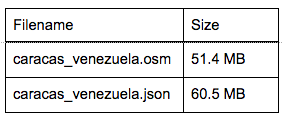

With the output file generated I was able to create the MongoDB database (it was called "udacity" and the collection called “caracas”) with the following command:

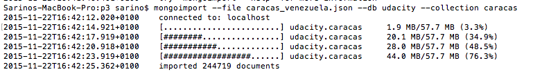

We can see the database successfully created:

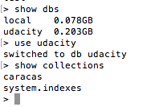

Next I explored the data in order to gather some insights from the dataset. The code for this is in the **data_overview.py** file. 

Total number of documents, nodes and ways:

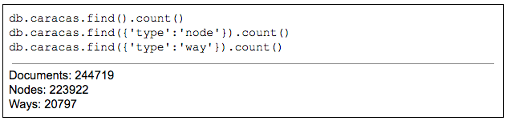

Total number of unique users:

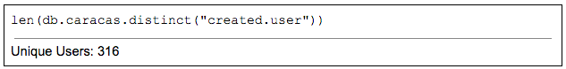

Top 10 contributors:

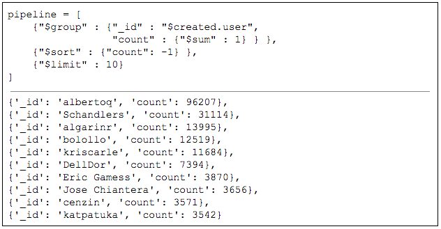

Users with only 1 or 2 contributions:

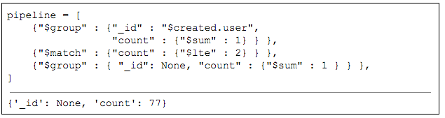

Top 10 amenities:

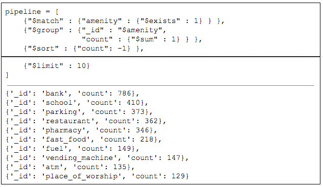

Top 10 shops:

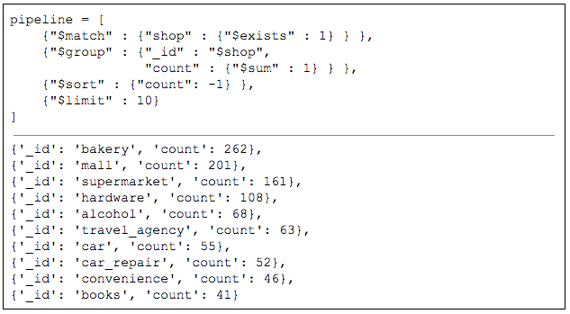

Nodes without address:

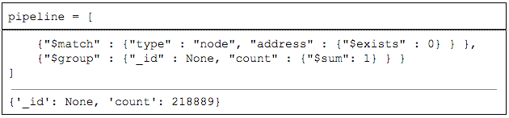

## Other ideas about the datasets

To start, I think it is important to state that clearly the data is incomplete. In the sense that most places that really exist in Caracas are not present or updated in the data. However, for the purpose of wrangling it is useful. 

Something that surprised me was that there is a clear top contributor. This user added 39.31 % of the "documents" in the database. Its also surprising to see the amount of detail this user adds to the data; things like the types of fuel available in the gas stations, the internet provider of some amenities, emails and websites, and opening hours of businesses. Its very nice that there are so many “map features”, however it’s not clear to me how to take advantage of all of them. One of the problems of crowdsourcing is that it can cause discrepancies which will translate in a worst experience for the users of the map. Simplifying the map features would definitely help.

I tried to focus the analysis with the queries on real places from the dataset (amenities and shops), rather than analysing the "way" tags that would include streets, roads, areas, etc. Initially when I downloaded the OSM dataset, I suspected most nodes were used for the purpose of referencing “ways”. Therefore I looked for the number of nodes without address and found that these represented 97.75 % of nodes on the data. 

So depending on the analysis required I think, as a way to improve the dataset, it would be interesting to remove these nodes from the database. Or possibly creating separate "collections" on the database, one for nodes with amenities and shops, and one for ways and their reference nodes. Finally, another problem with the “map area” chosen is that in Venezuela the OpenStreetMap platform is not well known. So the community is small which makes it hard to keep updated. I’m sure a reward system for accurate data would be very beneficial to this project, but maybe it would be a measure that contradicts the “community driven” approach they have.**
**

## References

* [http://wiki.openstreetmap.org/wiki/Map_Features](http://wiki.openstreetmap.org/wiki/Map_Features)
* [http://wiki.openstreetmap.org/wiki/Elements](http://wiki.openstreetmap.org/wiki/Elements)
* [https://docs.mongodb.org/manual/reference/operator/aggregation/](https://docs.mongodb.org/manual/reference/operator/aggregation/)
* [http://jsonviewer.stack.hu/](http://jsonviewer.stack.hu/)
* [http://code.opoki.com/loading-utf-8-json-file-in-python/](http://code.opoki.com/loading-utf-8-json-file-in-python/)
* Video from Udacity’s G+ page: MongoDB Basics: Using a local MongoDB server
* [https://docs.mongodb.org/manual/reference/operator/aggregation/match/](https://docs.mongodb.org/manual/reference/operator/aggregation/match/#pipe._S_match)
* [http://www.pac.com.ve/codigospostales/codigopostal.php?e=caracas](http://www.pac.com.ve/codigospostales/codigopostal.php?e=caracas)
