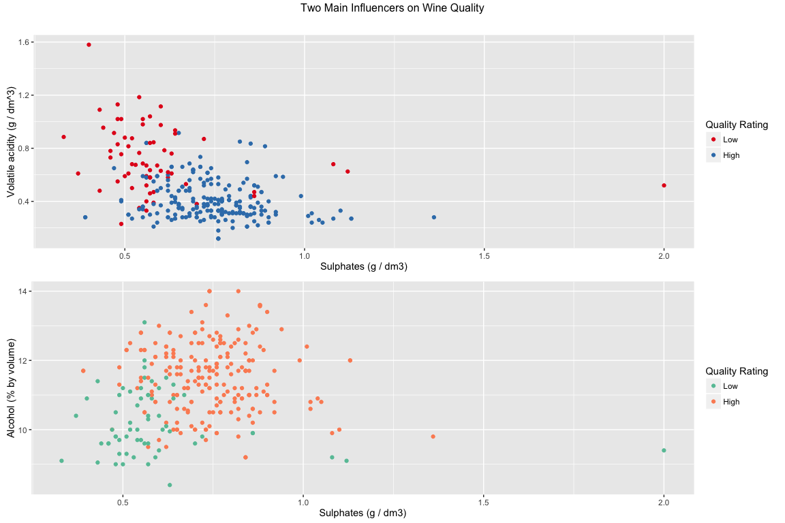

Red Wine Data Exploration
=========================

Introduction
============

In the following project, I will explore an analyze a data set containing information about the "chemical properties" of **red wines** and "quality ratings" provided by experts.

The goal is to get an idea of *which chemical properties influence the quality of red wine*. The quality rating can be between 0 (very bad) and 10 (excellent).

### Variables in the data set

``` r
str(wines)
```

    ## 'data.frame':    1599 obs. of  13 variables:
    ##  $ X                   : int  1 2 3 4 5 6 7 8 9 10 ...
    ##  $ fixed.acidity       : num  7.4 7.8 7.8 11.2 7.4 7.4 7.9 7.3 7.8 7.5 ...
    ##  $ volatile.acidity    : num  0.7 0.88 0.76 0.28 0.7 0.66 0.6 0.65 0.58 0.5 ...
    ##  $ citric.acid         : num  0 0 0.04 0.56 0 0 0.06 0 0.02 0.36 ...
    ##  $ residual.sugar      : num  1.9 2.6 2.3 1.9 1.9 1.8 1.6 1.2 2 6.1 ...
    ##  $ chlorides           : num  0.076 0.098 0.092 0.075 0.076 0.075 0.069 0.065 0.073 0.071 ...
    ##  $ free.sulfur.dioxide : num  11 25 15 17 11 13 15 15 9 17 ...
    ##  $ total.sulfur.dioxide: num  34 67 54 60 34 40 59 21 18 102 ...
    ##  $ density             : num  0.998 0.997 0.997 0.998 0.998 ...
    ##  $ pH                  : num  3.51 3.2 3.26 3.16 3.51 3.51 3.3 3.39 3.36 3.35 ...
    ##  $ sulphates           : num  0.56 0.68 0.65 0.58 0.56 0.56 0.46 0.47 0.57 0.8 ...
    ##  $ alcohol             : num  9.4 9.8 9.8 9.8 9.4 9.4 9.4 10 9.5 10.5 ...
    ##  $ quality             : Ord.factor w/ 6 levels "3"<"4"<"5"<"6"<..: 3 3 3 4 3 3 3 5 5 3 ...

### Summary of the data set

``` r
summary(wines)
```

    ##        X          fixed.acidity   volatile.acidity  citric.acid   
    ##  Min.   :   1.0   Min.   : 4.60   Min.   :0.1200   Min.   :0.000  
    ##  1st Qu.: 400.5   1st Qu.: 7.10   1st Qu.:0.3900   1st Qu.:0.090  
    ##  Median : 800.0   Median : 7.90   Median :0.5200   Median :0.260  
    ##  Mean   : 800.0   Mean   : 8.32   Mean   :0.5278   Mean   :0.271  
    ##  3rd Qu.:1199.5   3rd Qu.: 9.20   3rd Qu.:0.6400   3rd Qu.:0.420  
    ##  Max.   :1599.0   Max.   :15.90   Max.   :1.5800   Max.   :1.000  
    ##  residual.sugar     chlorides       free.sulfur.dioxide
    ##  Min.   : 0.900   Min.   :0.01200   Min.   : 1.00      
    ##  1st Qu.: 1.900   1st Qu.:0.07000   1st Qu.: 7.00      
    ##  Median : 2.200   Median :0.07900   Median :14.00      
    ##  Mean   : 2.539   Mean   :0.08747   Mean   :15.87      
    ##  3rd Qu.: 2.600   3rd Qu.:0.09000   3rd Qu.:21.00      
    ##  Max.   :15.500   Max.   :0.61100   Max.   :72.00      
    ##  total.sulfur.dioxide    density             pH          sulphates     
    ##  Min.   :  6.00       Min.   :0.9901   Min.   :2.740   Min.   :0.3300  
    ##  1st Qu.: 22.00       1st Qu.:0.9956   1st Qu.:3.210   1st Qu.:0.5500  
    ##  Median : 38.00       Median :0.9968   Median :3.310   Median :0.6200  
    ##  Mean   : 46.47       Mean   :0.9967   Mean   :3.311   Mean   :0.6581  
    ##  3rd Qu.: 62.00       3rd Qu.:0.9978   3rd Qu.:3.400   3rd Qu.:0.7300  
    ##  Max.   :289.00       Max.   :1.0037   Max.   :4.010   Max.   :2.0000  
    ##     alcohol      quality
    ##  Min.   : 8.40   3: 10  
    ##  1st Qu.: 9.50   4: 53  
    ##  Median :10.20   5:681  
    ##  Mean   :10.42   6:638  
    ##  3rd Qu.:11.10   7:199  
    ##  Max.   :14.90   8: 18

Univariate Plots Section
========================

Let's start by getting a quick feel of the distributions of the variables with histograms.

<!-- --><!-- -->

Univariate Analysis
===================

### What is the structure of your dataset?

Regarding the structure of the data, I could observe the following:

-   The `X` variable works as an ID for each observation
-   The `quality` variable is discrete and its categorical
-   The rest of variables refer to the chemical properties of the wine and are numerical
-   There are 1599 observations

### What is/are the main feature(s) of interest in your dataset?

For me, the main feature of interest in the data set is the **quality**. As mentioned before, the goal is to have an idea of what determines the quality of red wine. Surprisingly, for all the observations in the dataset, the quality scores ranges from 3 to 8. There are no wines rated 1-2 or 9-10. This could be because its taking the "median" of at least 3 evaluations made by experts.

### What other features in the dataset do you think will help support your investigation into your feature(s) of interest?

After doing some [reading](http://www.emsb.qc.ca/laurenhill/science/wine.html), I believe some the 3 **acid related variables** and the 2 **sulfur dioxide related variables** will help support the investigation. Are key elements in the wine-making process and relate to the **pH**.

Apparently, [great wines have high **residual sugar**](https://en.wikipedia.org/wiki/Sweetness_of_wine#Residual_sugar), so this is also something to look at. It seems its also related to the **acidity** of the wine.

Looks like **sulphates** are important to [prevent oxidization and maintain wine fresh](http://www.thekitchn.com/the-truth-about-sulfites-in-wine-myths-of-red-wine-headaches-100878). Not sure if is a big influence because apparently its highly regulated worldwied.

Seems like **alcohol** is important to [shape the body of the wine, but its not a mayor indicator of quality](http://www.wollersheim.com/news/blog/ABV). This will also be related to the **density**.

### Did you create any new variables from existing variables in the dataset?

After reading more about [acids in wine](https://en.wikipedia.org/wiki/Acids_in_wine), I decided to create the variable `total.acidity` which is just the sum of all the acids:

``` r
wines <- transform(wines, total.acidity = fixed.acidity + volatile.acidity + citric.acid)
```

<!-- -->

Also, I created the variable `quality.rating` to group the wines according to the quality score:

``` r
wines$quality.rating <- ifelse(wines$quality < 5, 'low', 
                        ifelse(wines$quality < 7, 'average', 
                                                  'high'))

wines$quality.rating <- factor(wines$quality.rating, 
                               ordered = T, 
                               levels = c("low", "average", "high"))
```

<!-- -->

### Of the features you investigated, were there any unusual distributions? Did you perform any operations on the data to tidy, adjust, or change the form of the data? If so, why did you do this?

One of the distributions that called my attention was the **citric acid** distribution. It is quite unique an it appears the most common value is 0. Is it the actual data or could be due to an error in the data collection?

The data was already pretty tidy, so I performed no mayor change on it. Just the **X** variable was ignored as it just represents the ID or row number. It will be intersting to see if there are many **outliers**, and for this I will use boxplots:

<!-- -->

Bivariate Plots Section
=======================

Let's start by seeing how each variable correlated to the **quality** score:

    ##        fixed.acidity     volatile.acidity          citric.acid 
    ##           0.12405165          -0.39055778           0.22637251 
    ##        total.acidity       residual.sugar            chlordies 
    ##           0.10375373           0.01373164          -0.12890656 
    ##  free.sulfur.dioxide total.sulfur.dioxide              density 
    ##          -0.05065606          -0.18510029          -0.17491923 
    ##                   pH            sulphates              alcohol 
    ##          -0.05773139           0.25139708           0.47616632

Let's have another quick look by doing boxplots:

<!-- -->

Let's now look at the **scatterplot matrix** to try to find some relations between the features:


And finally, based on the matrix, let's see in more detail some interesting scatterplots:

<!-- --><!-- --><!-- --><!-- --><!-- --><!-- -->

Bivariate Analysis
==================

### Talk about some of the relationships you observed in this part of the investigation. How did the feature(s) of interest vary with other features in the dataset?

As we established before, the feature of interest is **quality**. We see the highest correlations with: alcohol (0.476), volatile.acidity (-0.39) and sulphates (0.251).

Alcohol has the highest positive correlation, meaning the best rated wines of the sample tend to have higher amounts of alcohol. This could be due to the influence of alcohol in the "body" of the wine, making it feel light or heavy in the mouth, as its also related to density.

Volatile acidity seems very important. We see a negative correlations and its probably beacuse this acidity could [ruin a wine](https://winemakermag.com/676-the-perils-of-volatile-acidity). It has influence on the aroma and flavor. Vinegar seems to have high amounts of this.

Finally, sulphates have a positive correlation with quality. This makes a lot of sense because sulphates play an important role in [preventing oxidization and maintaining freshness](http://www.thekitchn.com/the-truth-about-sulfites-in-wine-myths-of-red-wine-headaches-100878).

### Did you observe any interesting relationships between the other features (not the main feature(s) of interest)?

It was interesting to see how **fixed acidity** seems to have high relationship with other features. The strongest ones are: pH (-0.683), citric acidity (0.672) and density (0.668).

Of course it makes sense because pH is [the scale that tells us the acidity or basicity of an aqueous solution](https://en.wikipedia.org/wiki/PH).

On the other hand, I notice some features with almost no relationship at all. For example volatile acidity - residual sugar (0.00192) and residual sugar - sulphates (0.00553). I was surprised because after initial research, I expected residual sugar to be more related to quality (0.0137). It seems that most observations in the dataset have similar levels of residual sugar, so it looks that there is not much influence from this feature.

### What was the strongest relationship you found?

The strogest realtionship I found is between fixed acidity and pH. As I explained before, it makes a lot of sense. I also observed that the correlation between the created variable "total.acidity" and pH was the same (-0.683).

Multivariate Plots Section
==========================

Let's see some multivariate scatterplots using colors to see relations of qualite and other features together. I'll use a facet wrap with the created variable `quality.rating` for better visualizations.

#### Volatile acidity vs. others by quality:

<!-- -->

#### Alcohol vs. others by quality:

<!-- -->

#### Density vs. others by quality:

<!-- -->

#### Sulphates vs. others by quality:

<!-- -->

Now, let's explore a bit more the "acidity" features against quality:

<!-- -->

Finally, let's try to build some linear models to make predictions using the most relevant variables:

    ## 
    ## Calls:
    ## m1: lm(formula = as.numeric(quality) ~ alcohol, data = wines)
    ## m2: lm(formula = as.numeric(quality) ~ alcohol + volatile.acidity, 
    ##     data = wines)
    ## m3: lm(formula = as.numeric(quality) ~ alcohol + volatile.acidity + 
    ##     sulphates, data = wines)
    ## m4: lm(formula = as.numeric(quality) ~ alcohol + volatile.acidity + 
    ##     sulphates + citric.acid, data = wines)
    ## m5: lm(formula = as.numeric(quality) ~ alcohol + volatile.acidity + 
    ##     sulphates + citric.acid + fixed.acidity, data = wines)
    ## m6: lm(formula = as.numeric(quality) ~ alcohol + volatile.acidity + 
    ##     sulphates + citric.acid + fixed.acidity + density, data = wines)
    ## 
    ## =======================================================================================
    ##                        m1         m2         m3         m4         m5          m6      
    ## ---------------------------------------------------------------------------------------
    ##   (Intercept)       -0.125      1.095***   0.611**    0.646**    0.202      28.401     
    ##                     (0.175)    (0.184)    (0.196)    (0.201)    (0.224)    (15.163)    
    ##   alcohol            0.361***   0.314***   0.309***   0.309***   0.320***    0.298***  
    ##                     (0.017)    (0.016)    (0.016)    (0.016)    (0.016)     (0.020)    
    ##   volatile.acidity             -1.384***  -1.221***  -1.265***  -1.343***   -1.302***  
    ##                                (0.095)    (0.097)    (0.113)    (0.113)     (0.116)    
    ##   sulphates                                0.679***   0.696***   0.701***    0.732***  
    ##                                           (0.101)    (0.103)    (0.103)     (0.104)    
    ##   citric.acid                                        -0.079     -0.469***   -0.460***  
    ##                                                      (0.104)    (0.137)     (0.137)    
    ##   fixed.acidity                                                  0.057***    0.077***  
    ##                                                                 (0.013)     (0.017)    
    ##   density                                                                  -28.268     
    ##                                                                            (15.198)    
    ## ---------------------------------------------------------------------------------------
    ##   R-squared              0.2        0.3        0.3        0.3        0.3        0.3    
    ##   adj. R-squared         0.2        0.3        0.3        0.3        0.3        0.3    
    ##   sigma                  0.7        0.7        0.7        0.7        0.7        0.7    
    ##   F                    468.3      370.4      268.9      201.8      167.0      140.0    
    ##   p                      0.0        0.0        0.0        0.0        0.0        0.0    
    ##   Log-likelihood     -1721.1    -1621.8    -1599.4    -1599.1    -1589.6    -1587.9    
    ##   Deviance             805.9      711.8      692.1      691.9      683.7      682.2    
    ##   AIC                 3448.1     3251.6     3208.8     3210.2     3193.3     3191.8    
    ##   BIC                 3464.2     3273.1     3235.7     3242.4     3230.9     3234.8    
    ##   N                   1599       1599       1599       1599       1599       1599      
    ## =======================================================================================

Multivariate Analysis
=====================

### Talk about some of the relationships you observed in this part of the investigation. Were there features that strengthened each other in terms of looking at your feature(s) of interest?

The plot here were mostly aligned to what we have been observing before. These are the main 4 things I found:

-   Good quality wines tend to have a lower amount of volatile acidity.
-   Good quality wines tend to have a higher alcohol concentration.
-   Bad quality wines tend to have lower amount of sulphates.
-   Good quality wines tend to have higher amount of citric acid.

The first 2 are the most strongly related with the feature of interest. And they are strenghthened when combined on the plots with **sulphates.**

### Were there any interesting or surprising interactions between features?

By doing the multivariate plots, it was easier to identify how acids affect the quality. So by looking at the plots where I compare the interactions between acids, I could see that higher quality wines ten to have higher amount of **citric acid** and lower amounts of **volatile acidity**.

### OPTIONAL: Did you create any models with your dataset? Discuss the strengths and limitations of your model.

I created several linear models and compared them. As I added variables to the model, the **R-squared** didn't changed. This could be an indicator that the data we have is not enough to make a good predictive model for wine **quality**. I would also say that the dataset has very few observations of "low" and "high" quality wines. Most are in the "average"" group, which can make it hard to make a model to really predict the quality based on this dataset.

For example, I took took the values of observartion No. 1121, which has a quality of 8 and used it to make a prediction with the model:

``` r
this_wine <- data.frame(alcohol = 13.1, 
                       volatile.acidity = 0.540,
                       sulphates = 0.72, 
                       citric.acid = 0.34,
                       fixed.acidity = 7.9,
                       density = 0.99235)

model_estimate <- predict(m6, newdata = this_wine, interval="prediction", level = .95)
```

This was the result:

    ##        fit      lwr      upr
    ## 1 4.523126 3.234322 5.811931

------------------------------------------------------------------------

Final Plots and Summary
=======================

### Plot One

<!-- -->

### Description One

Alcohol was the feature with highest correlation to quality. Its easy to see in this plot how the better quality wines tend to have higher alcohol levels.

There are some outliers, some wines with a quality score of 5 with high level of alcohol that were not considered of "high quality". Maybe due to high levels of volatile acidity. Let's look at the **mean alcohol levels by quality rating**:

    ## wines$quality.rating: low
    ## [1] 10.21587
    ## -------------------------------------------------------- 
    ## wines$quality.rating: average
    ## [1] 10.25272
    ## -------------------------------------------------------- 
    ## wines$quality.rating: high
    ## [1] 11.51805

### Plot Two

<!-- -->

### Description Two

With this plot is easier to see the effect of the acid components in wine on quality. The most relevant seems to be the effect of volatile acidity, we can see that the high quality wines tend to have less of this.

Also, we can see the citric acid has influence. Its clear that the high quality wines have a higher concentration of this acid. Again, let's look at the **means by quality rating for each acid feature**:

##### *Fixed acidity*

    ## wines$quality.rating: low
    ## [1] 7.871429
    ## -------------------------------------------------------- 
    ## wines$quality.rating: average
    ## [1] 8.254284
    ## -------------------------------------------------------- 
    ## wines$quality.rating: high
    ## [1] 8.847005

##### *Volatile acidity*

    ## wines$quality.rating: low
    ## [1] 0.7242063
    ## -------------------------------------------------------- 
    ## wines$quality.rating: average
    ## [1] 0.5385595
    ## -------------------------------------------------------- 
    ## wines$quality.rating: high
    ## [1] 0.40553

##### *Citric acid*

    ## wines$quality.rating: low
    ## [1] 0.1736508
    ## -------------------------------------------------------- 
    ## wines$quality.rating: average
    ## [1] 0.2582638
    ## -------------------------------------------------------- 
    ## wines$quality.rating: high
    ## [1] 0.3764977

### Plot Three

<!-- -->

### Description Three

For this plot, I used a subset of the data, I removed the "average" wines to highlight the differences between low and high quality wines.

This plot reinforces what we saw in the previous plots. It shows that high quality wines tend to have high levels of alcohol and low levels of volatile acidity.

In addition, it shows that low quality wines tend to have a lower amount of sulphates. Let's look at **mean sulphates for low and high quality wines **:

    ## wines$quality.rating: low
    ## [1] 0.5922222
    ## -------------------------------------------------------- 
    ## wines$quality.rating: average
    ## [1] 0.6472631
    ## -------------------------------------------------------- 
    ## wines$quality.rating: high
    ## [1] 0.7434562

------------------------------------------------------------------------

Reflection
==========

The purpose of this project was to do EDA to identify the elements that influence wine quality. By plotting the data in different ways and determining correlations I determined the variables I wanted to examine in more detail and found that the biggest drivers of quality (at least in this dataset) are: alcohol, acidity and sulphates.

Even so, none of the features had a considerable high correlation to quality. Something that would hint from early on that it would be difficult to make predictions of wine quality from this data.

As I found acidity to be of importance, I decided to create the variable `total.acidity`, but it didn't showed much significance. Different acids seem to influence the wine in different ways (as we saw with volatile and citric), so adding all the acids in one variable wasn't very usefull. On the other hand, the other variable I created (`quality.rating`) helped group wines according to quality score and was helpful when I created plots.

I tried to create a linear model to predict quality, but it wasn't very accurate. In my opinion, one of the key limitations of this dataset is that most of the observations are of "average" quality. This would make it hard to predict what is a "low" or "high" quality wine. Perhaps with more advanced techniches a better model could be made.

In the end, determining the quality of a wine seems to be a [mix of objective and subjective elements](http://www.businessinsider.com/recognize-high-quality-wine-2014-6). But I believe the findings of my analysis to be reasonable and also aligned to what I was able to research online.
