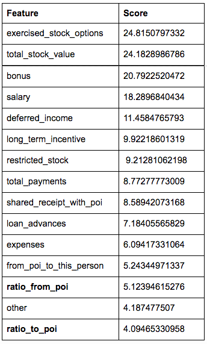
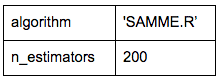
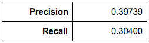
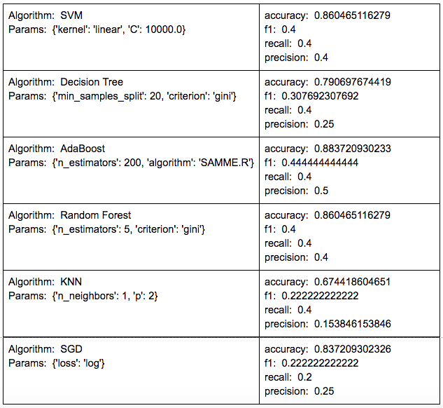

# Identify Fraud from Enron Email

### *Goal of the project and dataset*

The goal of this project is to use machine learning techniques and algorithms to identify persons of interest (POIs) within Enron employees that may have committed fraud. We’ll be using the public Enron financial and email dataset. Background on the dataset:

* Total number of data points: 146

* Total number of POIs: 18 (previously identified as POIs)

* Number of features used: 21 (14 financial, 6 email and 1 POI label)

The given dataset seems challenging to answer the project question mainly because there are very few labeled POIs compared to non-POIs. For most people in the dataset there are missing values which are denoted as ‘NaN’. For example, of the 146, there are 95 with quantified salary and 111 with a known email address.

Regarding outliers in the dataset, I was able to identify 2:

* TOTAL: This is likely a spreadsheet quirk

* THE TRAVEL AGENCY IN THE PARK: This is not a person

The 2 outliers were removed from the dataset.  

### *Engineering and optimizing feature selection*

First, I engineered 2 additional features (**ratio_to_poi** and **ratio_from_poi**). For each person I wanted to check the ratio of all the messages sent, what % is to a POI. Similarly I wanted to check of the messages received, the % that were from a POI. The rationale is that a person with high ratio of interaction with a POI (either "to" or “from”) could also be linked to fraud. 

After adding the 2 features to the dataset, I decided to use an automated feature selection function **SelectKBest** to get the best 15 features (k = 15). I did several tests changing the k value and decided to use k = 15 because it showed the best precision and recall. The features scores were:

Finally, I wanted to scale the features. The main reason for this is that we see different types of values like "numbers of mails sent" and “salary” which are represented in different units. To scale the features I used **MinMaxScaler**. At this point I had the data ready to be tested with the different algorithms.  

### *Picking and tuning an algorithm*

After multiple testing I ended up using **AdaBoost**. I performed multiple tests with the following algorithms:

* Support Vector Machine

* Decision Tree

* AdaBoost

* Random Forest

* K Nearest Neighbor

* Stochastic Gradient Descent

The algorithms had different performances. See Appendix to check the difference in performance among the algorithms tested in the poi_id.py file. The approach I took was to run all of them and compare metrics like accuracy, precision and recall to see which had better performance. To get the best of each algorithm we need to "tune" them. This means that we need to assign the best possible value to the parameters that each algorithm uses. This is key to optimize processing, performance and results. 

For this I used **GridSearchCV**. This was really useful because it automated most of the process. It allowed me to go through many combinations of parameters for each algorithm and get the best one. By default, GridSearchCV optimizes for "accuracy", so I used the parameter **scoring** to optimize for “recall” since this provided the best results for me. The “tuned parameters” for the best performing AdaBoost classifier I got were:

### *Validation and evaluation*

Validation is a way to check that our machine learning algorithm is providing correct results. A classic mistake that happens if we don’t validate correctly is that our algorithm could perform very well on training data, but would have a poor performance when using test data (over fitting). I tried the **train_test_split** validation available in sklearn.cross_validation. Using 30% of the data for testing and setting the random_state parameter to 42. This was not considering that the dataset is unbalanced, so added the parameter **stratify**=labels to make sure there are POIs in both training and test sets.

The 2 evaluation metrics used were **precision** and **recall**. For AdaBoost, the chosen algorithm, this was the performance I got using the tester.py file:

It's good to note that sometimes the results would change due to some randomness when splitting the data. However, the performance is reasonably well considering the challenges of the dataset mentioned in the beginning. 

The recall would give us the probability of the algorithm to identify a POI given that the person is actually a POI. So 30.4% of the time an actual POI goes through the algorithm, it will correctly label him/her as POI. The precision would give the probability that a predicted POI is actually a POI. So 39.7% of the time the algorithm would identify someone as a POI it would be correct. In this type of investigations it would be better to be overly cautious. We would rather flag more possible POIs that eventually could be investigated more in detail if they are actually involved in the fraud.

### *Resources*

[http://scikit-learn.org/stable/documentation.html](http://scikit-learn.org/stable/documentation.html)

### *Appendix: Algorithm Performance*

