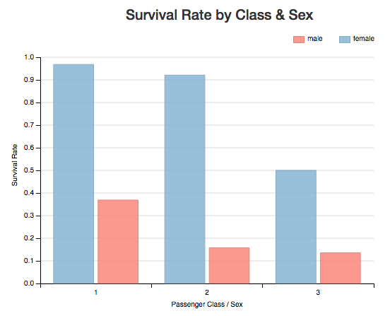
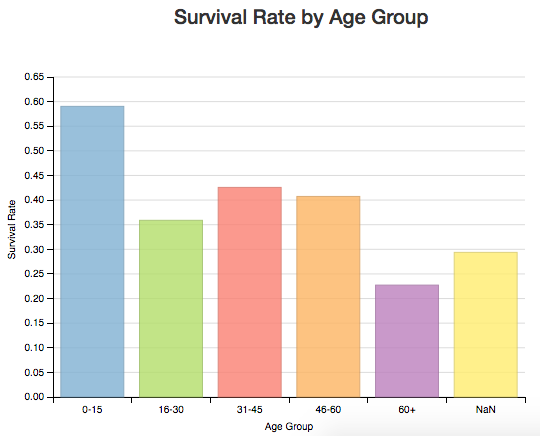
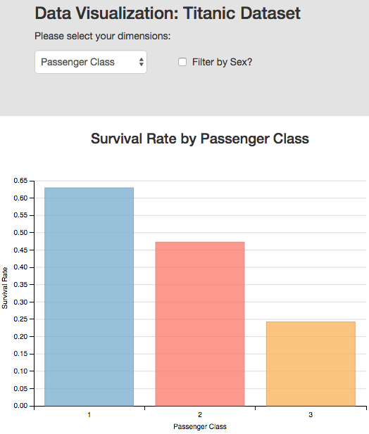
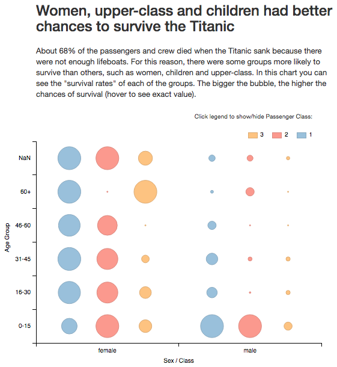

# Make Effective Data Visualization

### Summary

The data used for these visualizations contains information about passengers and crew from the Titanic ([source](https://www.google.com/url?q=https://www.kaggle.com/c/titanic/data&sa=D&ust=1466382653342000&usg=AFQjCNEW7aANWmQpRmhvJS1EKrCD5qUBNw)). The purpose of the visualizations is to get some insights about the demographics between the passengers who survived and the passengers who didn’t.

### Initial Design

The first thing I did was look at the initial data. I took out fields like passenger name and ticket number to clean the dataset, since we are focusing on demographic features. I also added an age_group column to facilitate the processing. After some EDA using Google Spreadsheets, I decided to show in 2 visualizations that women, children, and people from higher classes would have better chances to survive than the rest. For this I used bar charts created with **dimple.js**.

These initial visualizations code can be seen in the **index1.html** file.

### Feedback

I reached out to 3 people and asked for direct feedback about the initial visualization. These were the responses:

#### Response #1
The insight is clear, you can see from the charts that women, higher classes and young passenger had better chance of surviving than the rest. Charts are very clean and well labeled. Seems odd that for women of first class, survival rate is almost 100%. Maybe the dataset is missing information.

#### Response #2
Having “rates” really helps get a better idea of the chances of survival for each class/sex/age. Both charts are very straightforward and easy to read. The tooltip that animates when you hover a bar is also very useful since you can see the exact rate. As a small tweak, I don’t think it's necessary in the second chart to use different bar colors for each age group.

#### Response #3
The 2 charts accomplish the goal to communicate that women, children, and people from higher classes would be more likely to survive. However, it would be a great improvement to combine these 2 charts into one interactive chart. Let the user chose what relationships they want to compare and update the chart accordingly.

### Final Design
After taking into account the feedback, I made several changes to the visualizations. Mostly considering response #3 I added several “filters” with the purpose to make the visualization interactive and allow the users to chose what they want to compare. The chart would always have on the y axis the survival rate. But for the x axis, the user can now chose.

The final visualization code can be seen in the **index2.html** file.

### Final Design: 2nd Iteration

After receiving feedback from the Udacity coach, changed had to be made since the charts made are not explanatory enough. The idea is to communicate the main finding in a single visualization. Therefore, I rethought the whole chart. The main finding remains the same: I want to show that women, children, and people from higher classes would have better chances to survive than the rest.

For this I decided to take the 3 features analyzed separately in the previous charts and combine them in a way they can tell the story. 

**Y-axis**: Ordered age groups.

**X-axis**: 2 clearly separated sets: females & males. Here, **color** is used to facet the passenger class. 

**Visual encodings**: Here I show Survival Rates for each group. This is represented in the "size" of the circle because its a good way to differentiate one another. I decided to use "rates" beacause not all groups were of similar size, so I thought using rates would explain better the "likelyness" of a group to survive. 

**Animation**: I used animation to highligt differences among the "passenger class" feature. A simple animation that adds or hides a passenger class to allow comparison in more detail. 

Also, a general title and a concise introductory text were added. This helps highlight the relationships in the data I'm trying to explain. 

The final visualization code can be seen in the **index3.html** file.

See it live [here](https://bl.ocks.org/sarinograsso/raw/66b59a56f78aa3fcd0bbfce720a21966/).

### Resources

- [https://www.kaggle.com/c/titanic/data](https://www.google.com/url?q=https://www.kaggle.com/c/titanic/data&sa=D&ust=1466382653349000&usg=AFQjCNG_NUu7v4OOWDWhSd8U2CZfyoympg)
- [https://github.com/d3/d3/wiki](https://www.google.com/url?q=https://github.com/d3/d3/wiki&sa=D&ust=1466382653350000&usg=AFQjCNFUD95JDjFq-Wg064_J2__1-uGPMA)
- [https://github.com/PMSI-AlignAlytics/dimple/wiki](https://www.google.com/url?q=https://github.com/PMSI-AlignAlytics/dimple/wiki&sa=D&ust=1466382653350000&usg=AFQjCNGTfus-uUx8QARxOIya2RltfprDXg)
- [http://dimplejs.org/examples_viewer.html?id=bars_vertical_grouped](https://www.google.com/url?q=http://dimplejs.org/examples_viewer.html?id%3Dbars_vertical_grouped&sa=D&ust=1466382653351000&usg=AFQjCNGxfCs3GpRkQHR5wx_hBZTxMOOpUA)
- [http://dimplejs.org/advanced_examples_viewer.html?id=advanced_interactive_legends](http://dimplejs.org/advanced_examples_viewer.html?id=advanced_interactive_legends)

