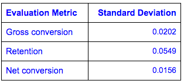
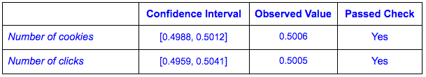
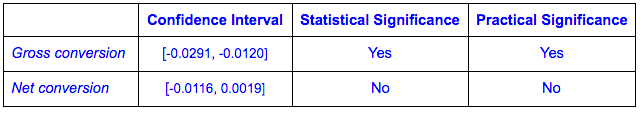
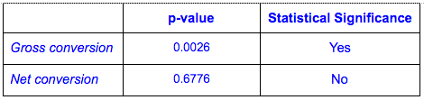

# Design an A/B Test

# 1. Experiment Design

## **Metric Choice**

**Invariant Metrics**: Number of cookies, Number of clicks and Click-through-probability

**Evaluation Metrics**: Gross conversion, Retention and Net conversion

* **Number of cookies**: Not a good evaluation metric because the experiment happens after the pageview and the click. Same reason why this is a good invariant metric.

* **Number of user-ids**: This is number of users who enroll in free trial. Therefore it is directly linked to the experiment, so it won’t be a good invariant metric. On the other hand, it could be used as evaluation metric since we could use it to track amount of students who enroll in the trial. But since it's not normalized we won’t use it. 

* **Number of clicks**: Not a good evaluation metric because the experiment happens after the pageview and the click. Same reason why this is a good invariant metric.

* **Click-through-probability**: Not a good evaluation metric because the experiment happens after the pageview and the click. Same reason why this is a good invariant metric.

* **Gross conversion**: The experiment will influence this, so it’s not a good invariant metric. It is however a good evaluation metric. Since it gives the users from experiment group the possibility to decide whether to enroll or not depending on how much time they have. The experiment will influence the decision and we will be able to see if a user is more likely to continue after the free trial. 

* **Retention**: Similar reasoning than for gross conversion. Good evaluation metric since we know that experiment users have enrolled already aware of the commitment they need. We would expect more cancellations from control group of users not having the time to do the course. 

* **Net conversion**: Again, similar to the other evaluation metrics. Directly linked to the experiment and good indicator to see if the experiment might ultimately increase revenue for the business. 

In order to launch the experiment, we need the data to confirm that the experiment helps to set the correct expectations on time needed to complete a course. This will reduce the amount of frustrated students that started a course but did not finish it. To confirm this, I would expect a statistically significant **decrease** of *gross conversion* and that *retention* and *net conversion* do** not** significantly decrease.  

## **Measuring Standard Deviation**

Calculations [here](https://docs.google.com/spreadsheets/d/19TeYWsLquzjPKtaNKyrdTa8gLPo005HmW0U8UILh6eg/edit#gid=0)

For **gross conversion** and **net conversion** have cookies as the denominator, which means that the unit of diversion is the same as the unit of analysis. Therefore, we can expect that the analytical estimate is comparable to the empirical. For **retention**, the unit of analysis is "number of user-ids to complete checkout" which is different than the unit of diversion. Therefore we expect the analytical estimate to be different than the empirical. In this case, it could be worth to do an empirical estimate. 

## **Sizing**

### **Number of Samples vs. Power**

I won’t be using the Bonferroni correction. Using the [online calculator](http://www.evanmiller.org/ab-testing/sample-size.html), I got the **sample size **needed per metric. With that and the baseline data provided, I calculated a total of **4,741,212** pageviews needed.

Calculations [here](https://docs.google.com/spreadsheets/d/19TeYWsLquzjPKtaNKyrdTa8gLPo005HmW0U8UILh6eg/edit#gid=1798402241)

The number of pageviews required significantly increases if we keep Retention as an evaluation metric. If we only focus on Gross and Net conversions, the required number of pageviews would be **685,275**.

### **Duration vs. Exposure**

I will eliminate Retention as evaluation metric and I would direct **75%** of the traffic to the experiment. Given this, we will need to run the experiment for **23 days**. 

I decided to remove Retention because if we kept it, the duration of the experiment would had to be 119 days (diverting 100% of traffic). Diverting 50% would have taken 238 days. We don’t want to spend such a long amount of time running the experiment. 

I general terms, this is not a risky experiment for Udacity. We are not doing any major (technical) changes in the backend of the site and it won’t affect already enrolled students. Also, no major ethical or policy risks involved. Main risk in my opinion is chance of reducing the number of new enrollments which could lead to decrease in number of students that continue and finish the course. 

This could hurt the revenue (not dramatically), so that’s why I think it’s a good idea to initially divert 75% of the traffic. We would get the results in around 3 weeks which is acceptable. Also, it would minimize risk in case of technical bug that we could encounter while running the experiment. 

# 2. Experiment Analysis

## **Sanity Checks**

Calculations [here](https://docs.google.com/spreadsheets/d/19TeYWsLquzjPKtaNKyrdTa8gLPo005HmW0U8UILh6eg/edit#gid=652134021)

## **Result Analysis**

### **Effect Size Tests**

Calculations [here](https://docs.google.com/spreadsheets/d/19TeYWsLquzjPKtaNKyrdTa8gLPo005HmW0U8UILh6eg/edit#gid=1097947672)

### **Sign Tests**

Calculations [here](https://docs.google.com/spreadsheets/d/19TeYWsLquzjPKtaNKyrdTa8gLPo005HmW0U8UILh6eg/edit#gid=1384697897)

### **Summary**

We need **both** evaluation metrics to match our expectations (decrease gross conversion and not decrease net conversion). Given this, the risk of a Type II error (false negative) could increase. Because of this, I didn’t use the Bonferroni correction. It would be more appropriate to use it in situations when we need **any** of the evaluation metrics to match expectations. Those are situations where the risk of a Type I error (false positive) increases.

There were no discrepancies observed between the effect size hypothesis tests and the sign tests. Both indicate that the change will significantly reduce the gross conversion, but won’t significantly increase (or not decrease) the net conversion. 

## **Recommendation**

As mentioned initially, in order to launch the experiment we were looking for 2 things: 1) a significant **decrease** in gross conversion and 2) a significant **not decrease** in net conversions. 

On one hand, the experiment significantly decreased gross conversion. We could assume from this that it helped to set the correct expectations on time needed to complete a course. This can be a positive thing since it could reduce the number of frustrated students. 

However, on the other hand, the confidence interval of net conversion includes the negative of the practical significance boundary (-0.0075). Not only the experiment did not significantly changed net conversions, it also showed that they could actually go down in a significant amount to the business. 

The change will not match both our initial expectations. Therefore, I would recommend **not** to launch the change. 

# 3. Follow-Up Experiment

The experiment we analyzed gave us a way encourage potential students to start the free trial depending on their time commitment. If a user didn’t have at least 5 hours a week, we would suggest not to enroll for the free trial. The goal is to reduce the number of frustrated students that quit the course halfway. In my opinion, besides lack of time, there is another key cause for frustration which is lack of pre-required knowledge and technical skills.

As a follow-up experiment, I would propose a change where if the user clicked "start free trial", they were taken to a more complex form or quiz. Here they would be asked their time commitment and other relevant questions to check if they have the basic knowledge and skills required. Then, depending on the score of the quiz we would finish the enrollment or we would recommend to brush up their knowledge by taking other courses first. 

**Hypothesis**

The hypothesis is similar to the one in the previous experiment. This will help the students realize if they have the necessary time, basic knowledge and skills to successfully take on the course. With this we expect again to reduce frustrated students that leave the trial. Also, it's key that this change won’t cause a drop in the number of students that go past the trial and complete the course. 

**Unit of Diversion**

I would use **cookie** as unit of diversion since the proposed change is still happening before the enrollment. 

**Metric Choice**

**Invariant Metrics**: Number of cookies and Number of clicks

**Evaluation Metrics**: Gross conversion and Net conversion

# 4. References

* [https://en.wikipedia.org/wiki/Bonferroni_correction](https://en.wikipedia.org/wiki/Bonferroni_correction)
* [http://www.evanmiller.org/ab-testing/sample-size.html](http://www.evanmiller.org/ab-testing/sample-size.html)
* [http://graphpad.com/quickcalcs/binomial2/](http://graphpad.com/quickcalcs/binomial2/)
